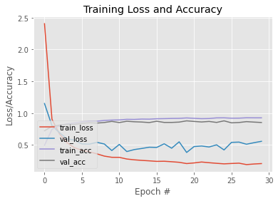

# Modeling of Human Activity Regcognition (HAR) through Computer Vision with AI

In this notebook, we will train a model to recognize 6 different classes of human activities using Artificial Intelligence with Machine Learning, Deep Learning, Computer Vision, and related theories. On our expectation, we need to get the model to a validation accuracy of `90%` in order to pass the assessment

## Objectives

- Prepare image data for training
- Create and compile a model for image classification
- Train an image classification model and observe the results

## The Dataset

The dataset comes from [Kaggle](https://www.kaggle.com/datasets/meetnagadia/human-action-recognition-har-dataset), The dataset structure is in the `dataset` folder. There are 6 categories of human activities: cycling, drinking, eating, fighting, running, and sleeping.

## Load ImageNet Base Model

We decide to start with a model pre-trained on ImageNet. Load the model with the correct weights, set an input shape, and choose to remove the last layers of the model.

```py
from tensorflow import keras

base_model = keras.applications.VGG16(
    weights='imagenet',
    input_shape=(224, 224, 3),
    include_top=False)
```

## Freeze Base Model

Next, we suggest freezing the base model. This is done so that all the learning from the ImageNet dataset does not get destroyed in the initial training.

```py
# Freeze base model
base_model.trainable = False
```

## Add Layers to Model

Now it's time to add layers to the pretrained model.

```py
# Create inputs with correct shape
inputs = keras.Input(shape=(224, 224, 3))

x = base_model(inputs, training=False)

# Add pooling layer or flatten layer
x = keras.layers.GlobalAveragePooling2D()(x)

# Add final 6 denses layer
outputs = keras.layers.Dense(6, activation = 'softmax')(x)

# Combine inputs and outputs to create model
model = keras.Model(inputs, outputs)
```

### Summarizing the Model

Run the cell below to summarize the model:

```py
model.summary()
```

<details>
<summary><strong>output</strong></summary>

```
Model: "model"
_________________________________________________________________
Layer (type)                 Output Shape              Param #
=================================================================
input_2 (InputLayer)         [(None, 224, 224, 3)]     0
_________________________________________________________________
vgg16 (Model)                (None, 7, 7, 512)         14714688
_________________________________________________________________
global_average_pooling2d (Gl (None, 512)               0
_________________________________________________________________
dense (Dense)                (None, 6)                 3078
=================================================================
Total params: 14,717,766
Trainable params: 3,078
Non-trainable params: 14,714,688
_________________________________________________________________
```

</details>

## Compile Model

Next, we will compile our model using loss option calls [categorical crossentropy](https://www.tensorflow.org/api_docs/python/tf/keras/losses/CategoricalCrossentropy) to reflect the fact that we want to fit into one of many categories, and measuring the accuracy of our model in metrics option:

```py
model.compile(optimizer='adam', loss='categorical_crossentropy',metrics=['accuracy'])
```

## Augment the Data

Augment the data to improve the dataset.

```py
from tensorflow.keras.preprocessing.image import ImageDataGenerator

datagen_train = ImageDataGenerator(samplewise_center=True)
    samplewise_center=True,  # set each sample mean to 0
    zoom_range=0.1,  # Randomly zoom image
    width_shift_range=0.1,  # randomly shift images horizontally (fraction of total width)
    height_shift_range=0.1,  # randomly shift images vertically (fraction of total height)
    horizontal_flip=True,  # randomly flip images horizontally
)

# No need to augment validation data
datagen_valid = ImageDataGenerator(samplewise_center=True)
```

## Load Dataset

Now it's time to load the train and validation datasets. Pick the right folders, as well as the right `target_size` of the images (it needs to match the height and width input of the model you've created).

```py
# load and iterate training dataset
train_it = datagen_train.flow_from_directory(
    "dataset/train/",
    target_size=(224, 224),
    color_mode="rgb",
    class_mode="categorical",
)
# load and iterate validation dataset
valid_it = datagen_valid.flow_from_directory(
    "dataset/valid/",
    target_size=(224, 224),
    color_mode="rgb",
    class_mode="categorical",
)
```

<details>
<summary><strong>output</strong></summary>

```
Found 4080 images belonging to 6 classes.
Found 960 images belonging to 6 classes.
```

</details>

### Summarizing the Training and Validation Data

```py
print("Number of data:", len(train_it))
print("Class indices: ", train_it.class_indices)
```

<details>
<summary><strong>output</strong></summary>

```
Number of data: 128
Class indices:  {'cycling': 0, 'drinking': 1, 'eating': 2, 'fighting': 3, 'running': 4, 'sleeping': 5}
```

</details>

## Train the Model

Time to train the model! Pass the `train` and `valid` iterators into the `fit` function, as well as setting the desired number of epochs.

```py
EPOCHS = 30
```

```py
history = model.fit(train_it,
                    validation_data=valid_it,
                    steps_per_epoch=train_it.samples/train_it.batch_size,
                    validation_steps=valid_it.samples/valid_it.batch_size,
                    epochs=EPOCHS)
```

<details>
<summary><strong>output</strong></summary>

```
Epoch 1/30
128/127 [==============================] - 50s 389ms/step - loss: 2.4053 - accuracy: 0.4953 - val_loss: 1.1509 - val_accuracy: 0.7229
Epoch 2/30
128/127 [==============================] - 46s 362ms/step - loss: 0.9037 - accuracy: 0.7458 - val_loss: 0.8029 - val_accuracy: 0.7927
Epoch 3/30
128/127 [==============================] - 45s 354ms/step - loss: 0.6752 - accuracy: 0.8015 - val_loss: 0.6934 - val_accuracy: 0.8104
Epoch 4/30
128/127 [==============================] - 45s 355ms/step - loss: 0.5365 - accuracy: 0.8316 - val_loss: 0.5991 - val_accuracy: 0.8240
Epoch 5/30
128/127 [==============================] - 45s 355ms/step - loss: 0.4573 - accuracy: 0.8449 - val_loss: 0.5756 - val_accuracy: 0.8229
Epoch 6/30
128/127 [==============================] - 46s 358ms/step - loss: 0.4164 - accuracy: 0.8645 - val_loss: 0.5168 - val_accuracy: 0.8396
Epoch 7/30
128/127 [==============================] - 45s 355ms/step - loss: 0.3926 - accuracy: 0.8728 - val_loss: 0.5126 - val_accuracy: 0.8490
Epoch 8/30
128/127 [==============================] - 45s 354ms/step - loss: 0.3608 - accuracy: 0.8730 - val_loss: 0.5419 - val_accuracy: 0.8438
Epoch 9/30
128/127 [==============================] - 45s 354ms/step - loss: 0.3251 - accuracy: 0.8855 - val_loss: 0.5153 - val_accuracy: 0.8531
Epoch 10/30
128/127 [==============================] - 45s 355ms/step - loss: 0.3063 - accuracy: 0.8912 - val_loss: 0.4125 - val_accuracy: 0.8708
Epoch 11/30
128/127 [==============================] - 46s 358ms/step - loss: 0.3056 - accuracy: 0.8936 - val_loss: 0.5087 - val_accuracy: 0.8521
Epoch 12/30
128/127 [==============================] - 45s 354ms/step - loss: 0.2796 - accuracy: 0.9032 - val_loss: 0.3966 - val_accuracy: 0.8729
Epoch 13/30
128/127 [==============================] - 46s 356ms/step - loss: 0.2667 - accuracy: 0.9015 - val_loss: 0.4276 - val_accuracy: 0.8646
Epoch 14/30
128/127 [==============================] - 45s 355ms/step - loss: 0.2579 - accuracy: 0.9071 - val_loss: 0.4452 - val_accuracy: 0.8604
Epoch 15/30
128/127 [==============================] - 45s 354ms/step - loss: 0.2508 - accuracy: 0.9056 - val_loss: 0.4646 - val_accuracy: 0.8521
Epoch 16/30
128/127 [==============================] - 45s 355ms/step - loss: 0.2423 - accuracy: 0.9120 - val_loss: 0.4616 - val_accuracy: 0.8729
Epoch 17/30
128/127 [==============================] - 45s 355ms/step - loss: 0.2444 - accuracy: 0.9140 - val_loss: 0.5183 - val_accuracy: 0.8542
Epoch 18/30
128/127 [==============================] - 46s 356ms/step - loss: 0.2367 - accuracy: 0.9169 - val_loss: 0.4493 - val_accuracy: 0.8542
Epoch 19/30
128/127 [==============================] - 44s 347ms/step - loss: 0.2277 - accuracy: 0.9181 - val_loss: 0.5495 - val_accuracy: 0.8594
Epoch 20/30
128/127 [==============================] - 45s 352ms/step - loss: 0.2080 - accuracy: 0.9248 - val_loss: 0.3825 - val_accuracy: 0.8792
Epoch 21/30
128/127 [==============================] - 45s 348ms/step - loss: 0.2180 - accuracy: 0.9186 - val_loss: 0.4753 - val_accuracy: 0.8698
Epoch 22/30
128/127 [==============================] - 44s 347ms/step - loss: 0.2324 - accuracy: 0.9135 - val_loss: 0.4841 - val_accuracy: 0.8615
Epoch 23/30
128/127 [==============================] - 44s 347ms/step - loss: 0.2214 - accuracy: 0.9157 - val_loss: 0.4683 - val_accuracy: 0.8698
Epoch 24/30
128/127 [==============================] - 45s 353ms/step - loss: 0.2120 - accuracy: 0.9257 - val_loss: 0.5021 - val_accuracy: 0.8542
Epoch 25/30
128/127 [==============================] - 45s 350ms/step - loss: 0.2034 - accuracy: 0.9265 - val_loss: 0.4222 - val_accuracy: 0.8792
Epoch 26/30
128/127 [==============================] - 45s 354ms/step - loss: 0.2093 - accuracy: 0.9206 - val_loss: 0.5409 - val_accuracy: 0.8479
Epoch 27/30
128/127 [==============================] - 45s 352ms/step - loss: 0.2141 - accuracy: 0.9216 - val_loss: 0.5451 - val_accuracy: 0.8531
Epoch 28/30
128/127 [==============================] - 45s 348ms/step - loss: 0.1918 - accuracy: 0.9272 - val_loss: 0.5115 - val_accuracy: 0.8667
Epoch 29/30
128/127 [==============================] - 44s 347ms/step - loss: 0.2011 - accuracy: 0.9265 - val_loss: 0.5358 - val_accuracy: 0.8594
Epoch 30/30
128/127 [==============================] - 45s 348ms/step - loss: 0.2078 - accuracy: 0.9265 - val_loss: 0.5574 - val_accuracy: 0.8531
```

</details>

### Visualizing the Training History

We will use the matplotlib library to visualize the training history in graphical format.

```py
import numpy as np
import matplotlib.pyplot as plt

# plot the training loss and accuracy
plt.style.use("ggplot")
plt.figure()
N = EPOCHS
plt.plot(np.arange(0, N), history.history["loss"], label="train_loss")
plt.plot(np.arange(0, N), history.history["val_loss"], label="val_loss")
plt.plot(np.arange(0, N), history.history["accuracy"], label="train_acc")
plt.plot(np.arange(0, N), history.history["val_accuracy"], label="val_acc")
plt.title("Training Loss and Accuracy")
plt.xlabel("Epoch #")
plt.ylabel("Loss/Accuracy")
plt.legend(loc="lower left")
plt.show()
```



## Unfreeze Model for Fine Tuning

Fine tuning the model with a very low learning rate.

```py
INIT_LR = .00001
EPOCHS = 10
```

```py
# Unfreeze the base model
base_model.trainable = True

# Compile the model with a low learning rate
model.compile(optimizer=keras.optimizers.RMSprop(learning_rate = .00001),
              loss = 'categorical_crossentropy' , metrics = ['accuracy'])
```

```py
history = model.fit(train_it,
                    validation_data=valid_it,
                    steps_per_epoch=train_it.samples/train_it.batch_size,
                    validation_steps=valid_it.samples/valid_it.batch_size,
                    epochs=EPOCHS)
```

<details>
<summary><strong>output</strong></summary>

```
Epoch 1/10
128/127 [==============================] - 67s 522ms/step - loss: 0.2746 - accuracy: 0.9091 - val_loss: 0.4364 - val_accuracy: 0.8708
Epoch 2/10
128/127 [==============================] - 58s 455ms/step - loss: 0.1767 - accuracy: 0.9370 - val_loss: 0.3660 - val_accuracy: 0.8979
Epoch 3/10
128/127 [==============================] - 57s 444ms/step - loss: 0.1293 - accuracy: 0.9539 - val_loss: 0.4728 - val_accuracy: 0.8979
Epoch 4/10
128/127 [==============================] - 56s 435ms/step - loss: 0.1015 - accuracy: 0.9618 - val_loss: 0.5204 - val_accuracy: 0.9000
Epoch 5/10
128/127 [==============================] - 56s 437ms/step - loss: 0.0846 - accuracy: 0.9699 - val_loss: 0.4794 - val_accuracy: 0.9031
Epoch 6/10
128/127 [==============================] - 56s 439ms/step - loss: 0.0560 - accuracy: 0.9789 - val_loss: 0.5331 - val_accuracy: 0.8969
Epoch 7/10
128/127 [==============================] - 56s 436ms/step - loss: 0.0592 - accuracy: 0.9792 - val_loss: 0.4727 - val_accuracy: 0.8958
Epoch 8/10
128/127 [==============================] - 56s 434ms/step - loss: 0.0443 - accuracy: 0.9838 - val_loss: 0.7544 - val_accuracy: 0.8740
Epoch 9/10
128/127 [==============================] - 56s 434ms/step - loss: 0.0485 - accuracy: 0.9870 - val_loss: 0.4625 - val_accuracy: 0.9094
Epoch 10/10
128/127 [==============================] - 56s 438ms/step - loss: 0.0441 - accuracy: 0.9865 - val_loss: 0.6065 - val_accuracy: 0.9031
```

</details>

## Evaluate the Model

Evaluate th model by executing the following cells. The evaluate function will return a tuple, where the first value is model loss, and the second value is model accuracy. So, we expect to have an accuracy value of `90% or higher`.

```py
model.evaluate(valid_it, steps=valid_it.samples/valid_it.batch_size)
```

<details>
<summary><strong>output</strong></summary>

```
30/30 [==============================] - 4s 139ms/step - loss: 0.4585 - accuracy: 0.9167
[0.45854225754737854, 0.9166666865348816]
```

</details>

## Saving the Model

Saving the model for the future use.

```py
from datetime import datetime

now = datetime.now()
filename = now.strftime("y%m%d") + "_har6.h5"
model.save(filename)
```

## Prediction

Using your own model from previous section for prediction steps.

## License

MIT license

Check out [LICENSE](/LICENSE) for more detail.
